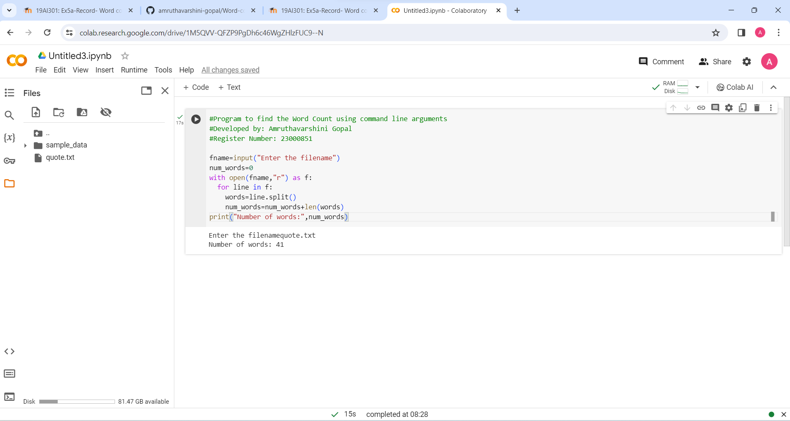

# Command-line-arguments-to-count-word

## AIM:

To write a python program for getting the word count from the contents of a file using command line arguments.

## EQUIPEMENT'S REQUIRED: 

1. PC

2. Anaconda - Python 3.7

## ALGORITHM: 

### Step 1:

First create a text file

### Step 2: 

Use for loop to count the number of words in the file
 
### Step 3:

Use split() to read the splitted words. We assume that words in a sentence are separated by a space character.

### Step 4: 

The length of the split list should equal the numbers of words in the test file

### Step 5: 

You can refine the count by cleaning the string prior to splitting or validating the words after splitting

### Step 6: 

End the program

## PROGRAM:
```
#Program to find the Word Count using command line arguments
#Developed by: Amruthavarshini Gopal
#Register Number: 23000851

fname=input("Enter the filename")
num_words=0
with open(fname,"r") as f:
  for line in f:
    words=line.split()
    num_words=num_words+len(words)
print("Number of words:",num_words)
```

## OUTPUT:


## RESULT:

Thus the program is written to find the word count from the text.
